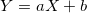

# ベイズ推定（一般化線形混合model）による標準化回帰係数の算出application
(論文にしようしているものなので、データの公開は知人のみ)

### 一般化線形混合modelとは？
ベイズ推定の中で、特に<span style="color: red; ">個人間の影響</span>を考えられるようにしたもの

今回のmodelはランダム切片modelというもの。<br>

<br>




という式があるとするならば、実際には測定や予測にある程度「ゆらぎ」があるので、実際には

とある確率分布になるというのがベイズ推定でよく用いられる考え方。

さらに、一般化線形混合modelはa,bが人によってばらつきがある「だろう」というのを前提にしてmodelを組むものとなっている。

今回は、a (つまり切片)のみに揺らぎがある可能性があるとして、βは人によって変わらないと仮定。それによって、標準化回帰係数が求められる。

### 結局ベイズ推定で何が求められるの？
誤解をおそれずに言うなら、それらしいようにランダムに出力された数値の群。

parametersブロックで宣言された変数(a0, b, ak[K], s_a, s_Y)およびtransformed parametersブロックで宣言された変数(a[k])のそれぞれについて
chain数 * (iter - warmup)分の数値が出力される。(詳しくはmain.ipynbのstanコード宣言部分を確認)

それの中央値や2.5パーセンタイルー97.5パーセンタイルを用いることで、代表値や信頼区間を産出したりする。
```print(fit)```
することで、だいたいの要素は確認できる。

### 標準化回帰係数とは？

においてYが1万くらいのオーダーのもの、xが0〜1のオーダーのものだと、aがおそらく10000overになるが、aの値が大きければ非常に重要かと言えばそうとは限らない。

故に、同じくらいのオーダーに持ってくる必要がある。
そのために


とすることによって、平均0, 分散1にx,yを正規化する。


こうしてもとめたa'が標準化回帰係数

### 参考
#### （そもそも）Latexの書き方
・Latexそのものについて<br>
http://www002.upp.so-net.ne.jp/latex/index.html <br>
・Githubに投稿する際には一工夫必要<br>
http://idken.net/posts/2017-02-28-math_github/ <br>

#### ベイズ推定について
・ベイズ推定そのものについて<br>
https://www.amazon.co.jp/dp/4065165369 <br>
・Stanの書き方について（上記書籍はStanからは離脱している）<br>
https://www.amazon.co.jp/dp/4320112423 <br>

#### pyStanについて
正直、このrepositoryのところでほぼOKな気はする。<br>
・公式document<br>
https://pystan.readthedocs.io/en/latest/getting_started.html <br>
・参考にした資料 <br>
http://tekenuko.hatenablog.com/entry/2017/10/14/150405 <br>
https://deepblue-ts.co.jp/%E7%B5%B1%E8%A8%88%E5%AD%A6/mcmc/%E3%83%99%E3%82%A4%E3%82%BA%E7%B5%B1%E8%A8%88%E3%83%A2%E3%83%87%E3%83%AA%E3%83%B3%E3%82%B0%E3%81%AB%E3%82%88%E3%82%8B%E3%83%87%E3%83%BC%E3%82%BF%E5%88%86%E6%9E%90%E3%82%92pystan%E3%81%A7%E5%AE%9F/ <br>

### 最後に
Mac OS CatalinaでStanを行おうとすると第一の関門はStanをinstallするところです。それが終わればほぼ終わりといってもいいでしょう。
